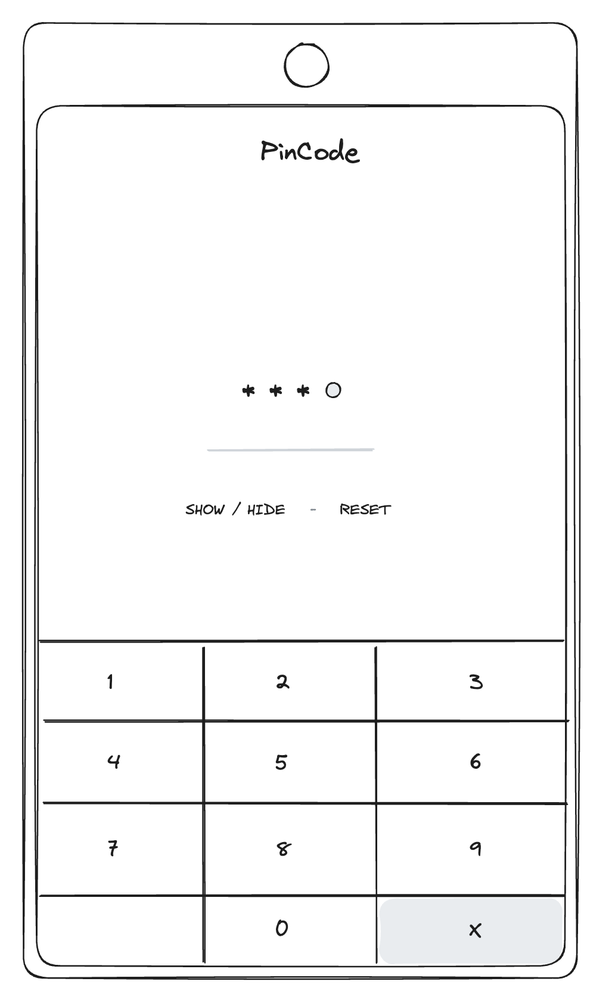
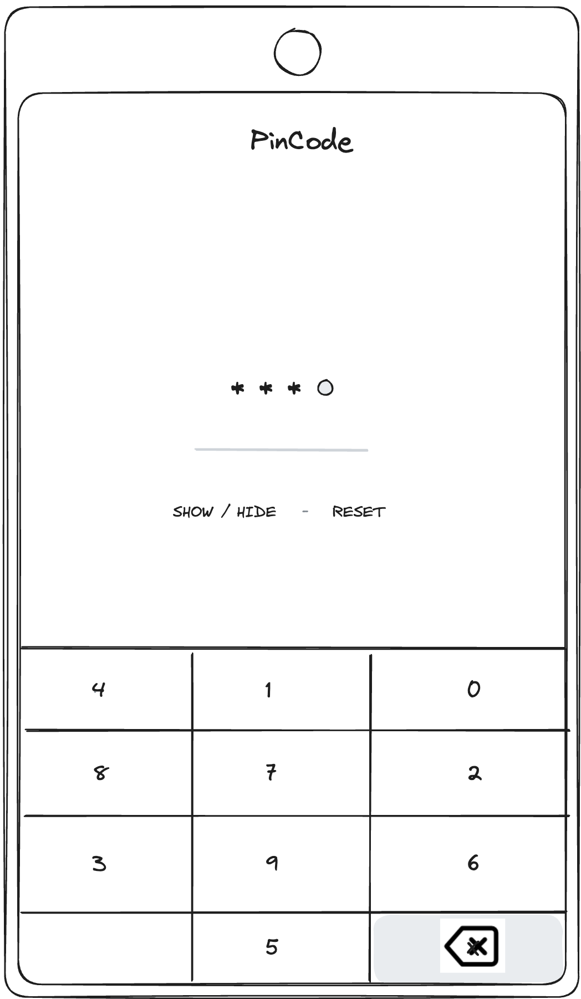
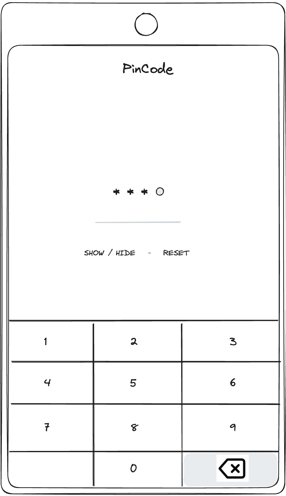

# rn-technical-assignment

## Part one

Create a custom digits keyboard with native code, in the form of a react native component bridge, which is later used in a react native screen to compose an authentication screen. Here are the indications:

-	Custom keyboard implemented in native code, exposed as a react native component bridge. Take the following considerations:

    - There is a digit section in the keyboard with buttons labelled 0 to 9. See the sketch below
    - There is a delete digit button labelled `X` which when pressed should undo the last digit pressed.
    - The custom keyboard should be able to send its value upon change (pressing a digit or remove button)

## Part two

Implement a react native app where you use the component implemented in the native layer. The screen is a representation of an authentication screen that has the following elements: 

- A screen header with title: `Pin Screen`
- An input group/section with 4 dots that represents the digits the user needs to input using the keyboard.
- As soon as the user presses a digit the dots become asterisks in order until 4 digits are pressed.
- A button with label `SHOW / HIDE` that on pressed will transform the asterisks into its unmasked digits the user pressed so that they can see what PIN code they input.
  - A button with label `RESET` that will be hidden or disabled by default and should appear as soon as a digit is pressed. The value should be reset upon pressing this button.
  - A section with the custom keyboard embedded with digits from `0-9` and a `X` or delete digit button.

## Things to Evaluate

- Ability to create native components and react native component bridges for them that enable communication between javascript and the native layer.
- Cross-platform: implement the native component at least in one platform, preferably in Kotlin
- Coding standards

## Nice to have

-	Use delete icon from feather in the [react-native-vector-icons](https://oblador.github.io/react-native-vector-icons/) library instead of the `X` label in the remove button.
- Randomized order of the digits on every render.
- Implementing this exercise for both android and iOS

## Submission Procedures

- Host the project in your own VCS account of choice.
- Send a link to the repository containing your submission.
- You have to 5 days to make the submission. After this, we will have a follow-up interview to review the coding exercise.

## Sketches

Sketch 1: For Part one and two

Sketch 2: Nice to have, randomized

Sketch 3: Nice to have, delete icon

